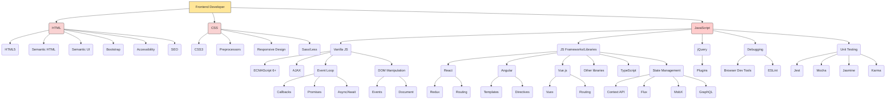

```mermaid
 graph TD
    A[Frontend Developer] --> B(HTML)
    A --> C(CSS)
    A --> D(JavaScript)
    classDef myClass fill:#f9d2d2,stroke:#333;
    class B,C myClass;
    B --> E(HTML5)
    B --> F(Semantic HTML)
    C --> G(CSS3)
    C --> H(Preprocessors)
    C --> I(Responsive Design)
    D --> J(Vanilla JS)
    D --> K(JS Frameworks/Libraries)
    J --> L(ECMAScript 6+)
    J --> M(AJAX)
    K --> N(React)
    K --> O(Angular)
    K --> P(Vue.js)
    K --> Q(Other libraries)
    N --> R(Redux)
    N --> S(Routing)
    O --> T(Templates)
    O --> U(Directives)
    P --> V(Vuex)
    P --> W(Routing)
    B --> X(Semantic UI)
    B --> Y(Bootstrap)
    C --> Z(Sass/Less)
    K --> AA(TypeScript)
    K --> AB(State Management)
    AB --> AC(Context API)
    AB --> AD(Flux)
    AB --> AE(MobX)
    AB --> AF(GraphQL)
    D --> AG(jQuery)
    AG --> AH(Plugins)
    J --> AI(Event Loop)
    AI --> AJ(Callbacks)
    AI --> AK(Promises)
    AI --> AL(Async/Await)
    J --> AM(DOM Manipulation)
    AM --> AN(Events)
    AM --> AO(Document)
    D --> AP(Debugging)
    AP --> AQ(Browser Dev Tools)
    AP --> AR(ESLint)
    B --> AS(Accessibility)
    B --> AT(SEO)
    D --> AU(Unit Testing)
    AU --> AV(Jest)
    AU --> AW(Mocha)
    AU --> AX(Jasmine)
    AU --> AY(Karma)
    style A fill:#ffe699,stroke:#333;
    style D fill:#ffcccc,stroke:#333;

```